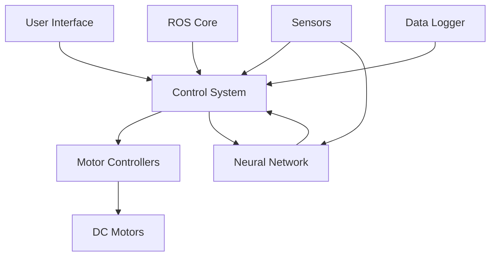
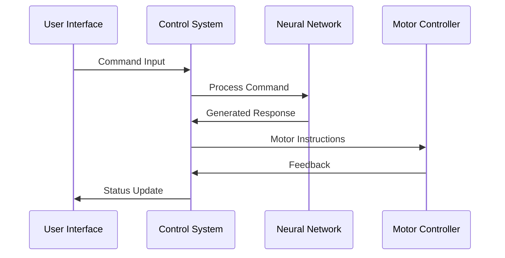
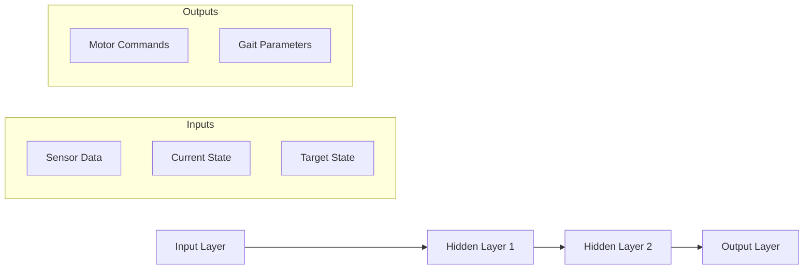

# NeuroSpider: Neural-Enhanced Spider Robot Control System

<div align="center">
  

  
  
  
  
</div>

## 📑 Table of Contents
- [Overview](#-overview)
- [Key Features](#-key-features)
- [System Architecture](#-system-architecture)
- [Hardware Setup](#-hardware-setup)
- [Software Requirements](#-software-requirements)
- [Installation Guide](#-installation-guide)
- [Usage Instructions](#-usage-instructions)
- [Project Structure](#-project-structure)
- [Neural Network Implementation](#-neural-network-implementation)
- [Development Roadmap](#-development-roadmap)
- [Troubleshooting](#-troubleshooting)
- [Contributing](#-contributing)
- [Research Team](#-research-team)
- [Acknowledgments](#-acknowledgments)
- [License](#-license)

## 🌟 Overview

NeuroSpider represents a cutting-edge fusion of robotics and neural networks, creating an adaptive six-legged robot platform. This project demonstrates advanced locomotion control through neural network integration, providing a foundation for research in bio-inspired robotics.

### Project Goals
- Develop an adaptive walking robot using neural network control
- Implement real-time environmental response capabilities
- Create a platform for testing bio-inspired locomotion algorithms
- Demonstrate practical applications of neural networks in robotics

### Applications
- Research in bio-inspired robotics
- Testing adaptive locomotion algorithms
- Educational platform for robotics and AI
- Prototype for industrial inspection robots

## 🎯 Key Features

### Hardware Capabilities
- **Advanced Motor Control**: Independent 6-leg operation with precise positioning
- **Sensor Integration**: Multiple feedback sensors for environmental awareness
- **Modular Design**: Easily replaceable components and expandable architecture
- **Power Management**: Efficient battery usage with status monitoring

### Software Features
- **Neural Network Integration**: Adaptive behavior learning and implementation
- **ROS Framework**: Industry-standard robotics middleware integration
- **Real-time Control**: Low-latency response to environmental changes
- **Data Logging**: Comprehensive system state monitoring and analysis

### Control Modes
1. **Manual Control**
   - Individual leg control through buttons
   - Coordinated movement patterns
   - Emergency stop functionality

2. **Autonomous Operation**
   - Neural network-guided movement
   - Obstacle avoidance
   - Terrain adaptation

3. **Research Mode**
   - Data collection for analysis
   - Parameter tuning interface
   - Custom behavior programming

## 🔧 System Architecture

### High-Level Architecture


### Control Flow


## 🛠 Hardware Setup

### Components List
| Component | Quantity | Specifications | Purpose |
|-----------|----------|----------------|----------|
| Arbotix-M Controller | 1 | 16MHz, 256KB Flash | Main controller |
| DC Motors | 6 | 12V, 100RPM | Leg actuation |
| L293D Driver | 6 | Dual H-Bridge | Motor control |
| LiPo Battery | 1 | 11.1V, 2200mAh | Power supply |
| Push Buttons | 8 | Momentary | User input |
| LEDs | 6 | 5mm, Various colors | Status indication |
| Chassis | 1 | 3D Printed | Robot frame |

### Circuit Diagram
\`\`\`
                    Power Distribution
                           │
                    ┌──────┴──────┐
                    │   Battery   │
                    │   11.1V    │
                    └──────┬──────┘
                           │
            ┌──────────────┼──────────────┐
            │              │              │
      ┌─────┴─────┐  ┌─────┴─────┐  ┌─────┴─────┐
      │  L293D #1  │  │  L293D #2  │  │  L293D #3  │
      └─────┬─────┘  └─────┬─────┘  └─────┬─────┘
            │              │              │
      ┌─────┴─────┐  ┌─────┴─────┐  ┌─────┴─────┐
      │  Motor 1   │  │  Motor 2   │  │  Motor 3   │
      └───────────┘  └───────────┘  └───────────┘
\`\`\`

### Pin Configuration
```cpp
// Motor Pin Assignments
const int MOTOR_PINS[6][3] = {
    {2, 3, 4},   // Motor 1: {A1, A2, Enable}
    {5, 6, 7},   // Motor 2
    {45, 46, 44}, // Motor 3
    {17, 18, 19}, // Motor 4
    {22, 23, 24}, // Motor 5
    {27, 28, 29}  // Motor 6
};

// Button Pin Assignments
const int BUTTON_PINS[6] = {11, 13, 15, 20, 25, 30};
```

## 💻 Software Requirements

### Development Environment
- Ubuntu 20.04 LTS
- ROS Noetic
- Arduino IDE 1.8.x or higher
- Python 3.8+
- Git

### Required Libraries
1. **ROS Packages**
   ```bash
   sudo apt-get install ros-noetic-rosserial
   sudo apt-get install ros-noetic-rosserial-arduino
   sudo apt-get install ros-noetic-control-msgs
   ```

2. **Python Libraries**
   ```bash
   pip install numpy
   pip install tensorflow
   pip install scipy
   pip install matplotlib
   ```

3. **Arduino Libraries**
   - L293D Motor Driver
   - ROSserial Arduino Library
   - Servo Library

## 📥 Installation Guide

### Step-by-Step Setup

1. **Clone Repository**
   ```bash
   git clone https://github.com/yourusername/neurospider.git
   cd neurospider
   ```

2. **Install Dependencies**
   ```bash
   # Install ROS dependencies
   ./scripts/install_ros_deps.sh

   # Install Python requirements
   pip install -r requirements.txt
   ```

3. **Build Project**
   ```bash
   # Initialize ROS workspace
   mkdir -p ~/neurospider_ws/src
   cd ~/neurospider_ws/src
   catkin_init_workspace

   # Build the workspace
   cd ~/neurospider_ws
   catkin_make
   ```

4. **Configure Arduino**
   ```bash
   # Upload Arduino code
   cd arduino
   arduino-cli compile --fqbn arduino:avr:mega
   arduino-cli upload -p /dev/ttyACM0 --fqbn arduino:avr:mega
   ```

### Configuration Files
```yaml
# config/robot_params.yaml
robot:
  num_legs: 6
  control_rate: 50  # Hz
  max_speed: 100    # RPM
  
neural_network:
  hidden_layers: [64, 32]
  learning_rate: 0.001
  activation: "relu"
```

## 🎮 Usage Instructions

### Basic Operation
1. **Power Up**
   ```bash
   # Start ROS core
   roscore

   # Launch robot nodes
   roslaunch neurospider_control start.launch
   ```

2. **Manual Control**
   ```bash
   # Launch control interface
   rosrun neurospider_control manual_control.py
   ```

3. **Autonomous Mode**
   ```bash
   # Start autonomous navigation
   roslaunch neurospider_navigation autonomous.launch
   ```

### Control Commands
| Command | Description | Button Combination |
|---------|-------------|-------------------|
| Forward | Move forward | Right + Motor buttons |
| Backward | Move backward | Left + Motor buttons |
| Stop | Emergency stop | All buttons |
| Turn Right | Rotate clockwise | Right + Select motors |
| Turn Left | Rotate counter-clockwise | Left + Select motors |

### Example Code
```python
# Control script example
from neurospider.control import RobotController

def main():
    controller = RobotController()
    
    # Initialize robot
    controller.initialize()
    
    # Set walking pattern
    controller.set_gait('tripod')
    
    # Start walking
    controller.start_walking()
    
    # Monitor status
    while controller.is_active():
        status = controller.get_status()
        print(f"Robot Status: {status}")
        
if __name__ == '__main__':
    main()
```

## 📂 Project Structure
```
neurospider/
├── arduino/
│   ├── main/
│   │   ├── main.ino
│   │   ├── motor_control.h
│   │   └── neural_control.h
│   └── libraries/
├── ros/
│   ├── launch/
│   │   ├── start.launch
│   │   └── autonomous.launch
│   ├── src/
│   │   ├── control/
│   │   ├── navigation/
│   │   └── neural/
│   └── config/
├── neural/
│   ├── models/
│   │   ├── gait_controller.py
│   │   └── terrain_adapter.py
│   └── training/
├── docs/
│   ├── diagrams/
│   ├── api/
│   └── tutorials/
├── scripts/
│   ├── install_deps.sh
│   └── setup_workspace.sh
├── tests/
│   ├── unit/
│   └── integration/
└── README.md
```

## 🧠 Neural Network Implementation

### Architecture


### Training Process
1. **Data Collection**
   - Record sensor inputs
   - Log motor commands
   - Store environmental conditions

2. **Preprocessing**
   - Normalize sensor data
   - Extract relevant features
   - Split into training/validation sets

3. **Model Training**
   - Define network architecture
   - Train using collected data
   - Validate performance

4. **Deployment**
   - Load trained model
   - Real-time inference
   - Continuous adaptation

## 🛣 Development Roadmap

### Current Version (1.0.0)
- [x] Basic motor control implementation
- [x] Manual control interface
- [x] Simple gait patterns
- [x] Initial ROS integration

### Short-term Goals (1.1.0)
- [ ] Advanced gait patterns
- [ ] Improved sensor integration
- [ ] Basic autonomous navigation
- [ ] Enhanced user interface

### Long-term Vision (2.0.0)
- [ ] Full neural network integration
- [ ] Advanced terrain adaptation
- [ ] Swarm behavior capabilities
- [ ] Web-based control interface

## 🔧 Troubleshooting

### Common Issues and Solutions

1. **Motor Not Responding**
   - Check power connections
   - Verify pin assignments
   - Test L293D driver
   - Check LED status

2. **Neural Network Issues**
   - Verify model loading
   - Check input normalization
   - Monitor GPU memory usage
   - Review training logs


5. Create Pull Request

### Code Style
- Follow PEP 8 for Python code
- Use Arduino style guide for C++ code
- Document all functions and classes
- Include unit tests for new features

## 👨‍🔬 Research Team

### Author
**Md Khairul Islam**
- Institution: Hobart and William Smith Colleges, Geneva, NY
- Major: Robotics and Computer Science
- Research Focus: Neural robotics and adaptive control
- Contact: khairul.islam@hws.edu

### Advisor
**Chris Fietkiewicz**
- Position: Assistant Professor of Mathematics & Computer Science
- Research Areas: Robotics, Neural Networks, Control Systems
- Email: fietkiewicz@hws.edu

## 🙏 Acknowledgments
- Hobart and William Smith Colleges for research support
- ROS community for development tools
- Arduino community for hardware support
- Open-source contributors
