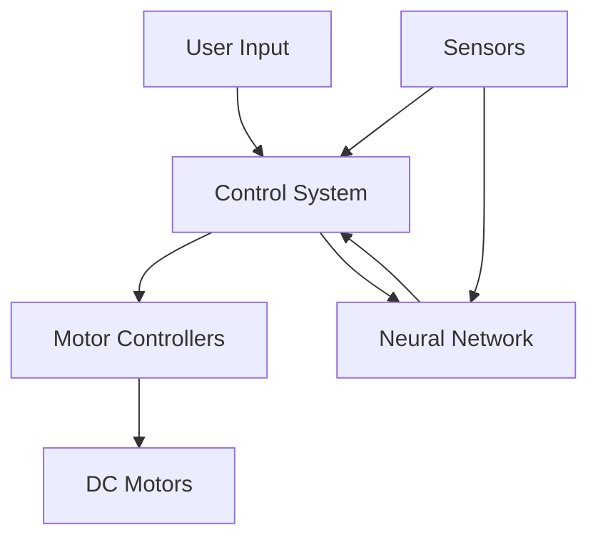

# NeuroSpider: Neural-Enhanced Spider Robot Control System


## Table of Contents
- [Overview](#overview)
- [Features](#features)
- [System Architecture](#system-architecture)
- [Hardware Requirements](#hardware-requirements)
- [Software Requirements](#software-requirements)
- [Installation](#installation)
- [Usage](#usage)
- [Project Structure](#project-structure)
- [Circuit Diagram](#circuit-diagram)
- [Control System](#control-system)
- [Future Development](#future-development)
- [Contributing](#contributing)
- [Research Team](#research-team)
- [License](#license)

## Overview
NeuroSpider is an advanced robotics research project that integrates neural networks with a six-legged spider robot platform. The project utilizes an Arbotix-M controller for precise motor control and implements adaptive behaviors through neural network integration.

### Key Components:
- Arbotix-M microcontroller board
- Six DC motors with L293D drivers
- Multiple feedback sensors
- ROS integration capabilities
- Neural network-based control system

## Features
- **Independent Motor Control**: Each leg can be controlled separately
- **Adaptive Movement**: Neural network-based motion adaptation
- **Real-time Feedback**: Sensor integration for environmental awareness
- **Multiple Control Modes**: 
  - Manual control through buttons
  - Autonomous operation
  - Neural network-guided movement

## System Architecture



## Hardware Requirements
- 1x Arbotix-M Controller Board
- 6x DC Motors
- 6x L293D Motor Drivers
- 6x LED Indicators
- 8x Push Buttons
- Power Supply (11.1V LiPo Battery)
- Various Connecting Wires
- Chassis Components

## Software Requirements
- Arduino IDE (1.8.x or higher)
- ROS Noetic
- Python 3.8+
- Required Libraries:
  - L293D Motor Driver Library
  - ROS Serial
  - Neural Network Libraries

## Installation

1. **Hardware Setup**
```bash
# Clone the repository
git clone https://github.com/yourusername/neurospider.git
cd neurospider

# Install required Arduino libraries
arduino-cli lib install L293D
arduino-cli lib install ROSserial
```

2. **Software Setup**
```bash
# Install ROS dependencies
sudo apt-get install ros-noetic-rosserial
sudo apt-get install ros-noetic-rosserial-arduino

# Build the project
catkin_make
```

## Usage

### Basic Operation
1. Power up the robot
2. Upload the Arduino code
3. Connect to ROS master
4. Start the control system:
```bash
roslaunch neurospider_control start.launch
```

### Manual Control
- Use individual buttons for each leg
- Left/Right buttons for direction control
- Combined button presses for complex movements

## Project Structure
```
neurospider/
├── arduino/
│   ├── main.ino
│   └── libraries/
├── ros/
│   ├── launch/
│   └── src/
├── neural/
│   ├── models/
│   └── training/
├── docs/
│   └── diagrams/
└── README.md
```

## Circuit Diagram

```
                                   +---------------------+
                                   |     Arbotix-M      |
                                   |                    |
  +--------+     +----------+      |    +-----------+  |
  | Button |---->| L293D #1 |----->|--->| Motor 1   |  |
  +--------+     +----------+      |    +-----------+  |
                                  |                    |
  +--------+     +----------+     |    +-----------+  |
  | Button |---->| L293D #2 |---->|--->| Motor 2   |  |
  +--------+     +----------+     |    +-----------+  |
                                  |                    |
                 [... More Motors ...]                 |
                                  |                    |
  +--------+     +----------+     |    +-----------+  |
  | Button |---->| L293D #6 |---->|--->| Motor 6   |  |
  +--------+     +----------+     |    +-----------+  |
                                  |                    |
                                  +--------------------+
```

## Control System

The control system implements a hierarchical architecture:

1. **Low-Level Control**
   - Motor speed and direction control
   - Button input processing
   - LED status indication

2. **Mid-Level Control**
   - Gait coordination
   - Movement patterns
   - Sensor data processing

3. **High-Level Control**
   - Neural network processing
   - Adaptive behavior
   - Path planning

## Future Development
- Advanced terrain adaptation
- Enhanced neural network integration
- Improved sensor fusion
- Autonomous navigation capabilities
- Web-based control interface

## Contributing
1. Fork the repository
2. Create your feature branch (`git checkout -b feature/AmazingFeature`)
3. Commit your changes (`git commit -m 'Add some AmazingFeature'`)
4. Push to the branch (`git push origin feature/AmazingFeature`)
5. Open a Pull Request

## Research Team

**Author:**
- **Md Khairul Islam**
  - Institution: Hobart and William Smith Colleges, Geneva, NY
  - Major: Robotics and Computer Science
  - Contact: khairul.islam@hws.edu

**Advisor:**
- **Chris Fietkiewicz**
  - Position: Assistant Professor of Mathematics & Computer Science
  - Email: fietkiewicz@hws.edu

## License
This project is licensed under the MIT License - see the [LICENSE.md](LICENSE.md) file for details.

---
**Note**: This project is part of ongoing research at Hobart and William Smith Colleges. For questions or collaboration opportunities, please contact the research team.
